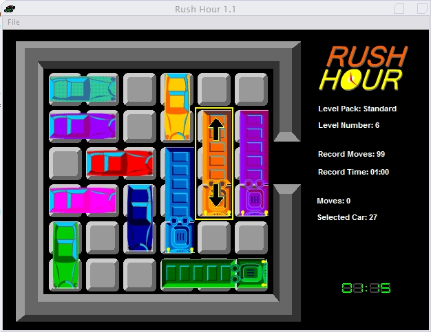



## RushHour Puzzle Game with Puzzle Editor included\. Nice Graphics

### Description

I was in love with RushHour since I first saw it. It comes in a little box with puzzle cards and nice little plastic cars and trucks, but it took too long for me to accomodate the cars each time I wanted to play a new puzzle. I then decided to clone this game for the PC. The package comes with all standard 40 levels of the original game, has a solution saver, a puzzle editor, a score routine, supports movements with mouse and with arrow keys, a nice-looking timer (7-segment-displays)... A complete game to excercise your brains.
 
### More Info
 

             |
---                |---
**Submitted On**   |2001-09-25 19:44:38
**By**             |[Mario A\. Di Vece](https://github.com/Planet-Source-Code/PSCIndex/blob/master/ByAuthor/mario-a-di-vece.md)
**Level**          |Intermediate
**User Rating**    |4.8 (63 globes from 13 users)
**Compatibility**  |VB 5\.0, VB 6\.0
**Category**       |[Games](https://github.com/Planet-Source-Code/PSCIndex/blob/master/ByCategory/games__1-38.md)
**World**          |[Visual Basic](https://github.com/Planet-Source-Code/PSCIndex/blob/master/ByWorld/visual-basic.md)
**Archive File**   |[RushHour\_P707724102002\.zip](https://github.com/Planet-Source-Code/mario-a-di-vece-rushhour-puzzle-game-with-puzzle-editor-included-nice-graphics__1-33679/archive/master.zip)

